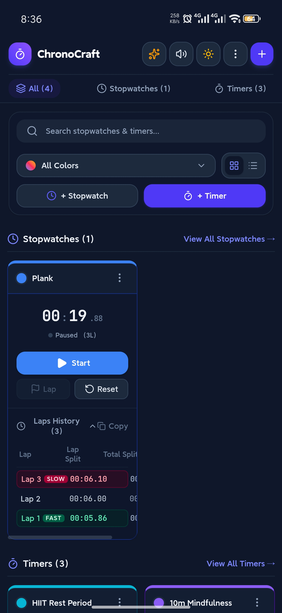
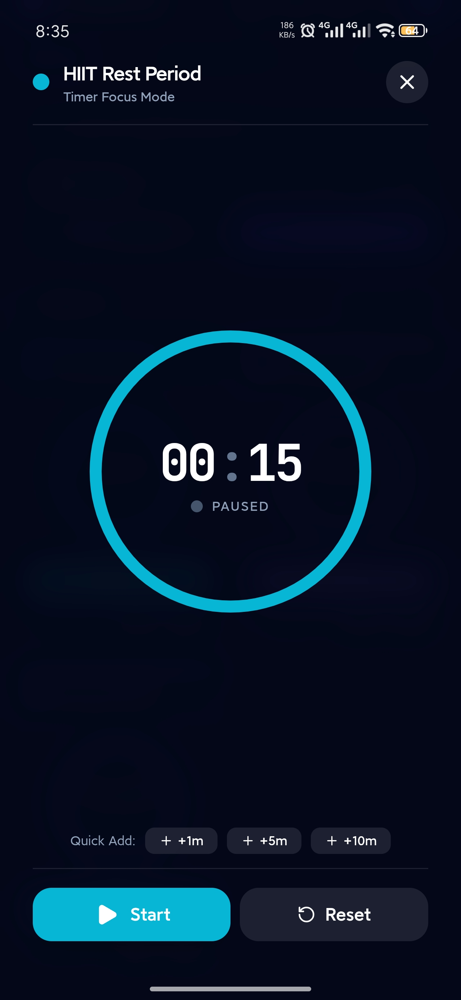
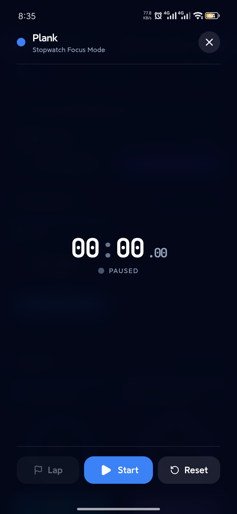
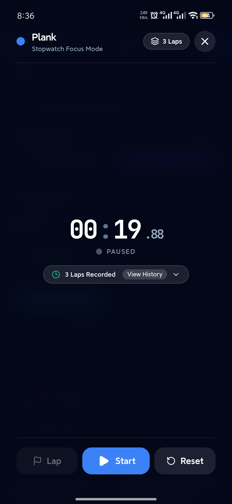
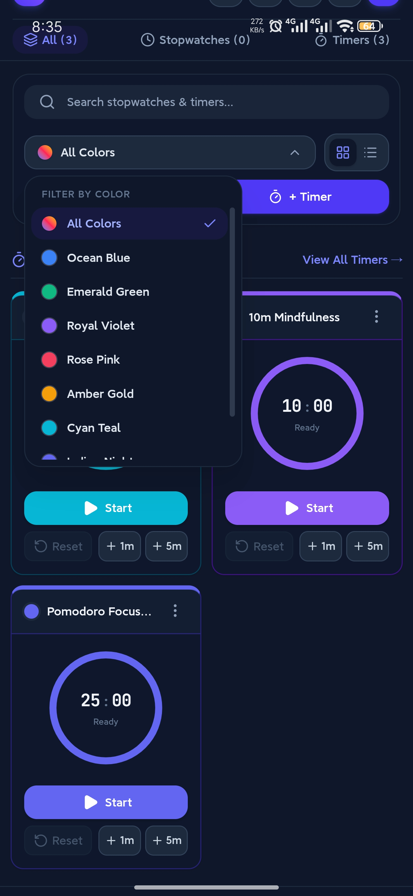
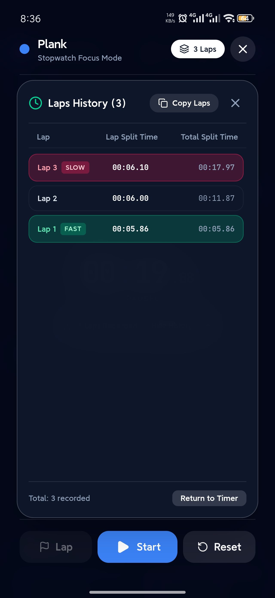

# ⏱️ ChronoCraft: Multi Timer & Stopwatch

<p align="center">
  
</p>

<p align="center">
  <strong>The multi-stopwatch & interval timer dashboard for people who juggle too many things at once.</strong>
</p>

<p align="center">
  <a href="https://github.com/ArafatRakib/ChronoCraft/releases/latest"></a>
  <a href="https://github.com/ArafatRakib/ChronoCraft/releases/latest/download/ChronoCraft-latest.apk"></a>
  <a href="https://github.com/ArafatRakib/ChronoCraft/actions/workflows/build-release.yml"></a>
  
    <a href="https://github.com/ArafatRakib/ChronoCraft"></a>
  <a href="https://accrescent.app"></a>
  <a href="https://arafatrakib.github.io/ChronoCraft/">
  
</a>
</p>

---

## ⚡ Download

Want to track your boiling eggs, 25-minute Pomodoro, and gym rest intervals simultaneously without having 4 phones on your desk?

<p align="center">
  <!-- Direct download button -->
  <a href="https://github.com/ArafatRakib/ChronoCraft/releases/latest/download/ChronoCraft-latest.apk">
  
  </a>
---

## 🧐 Why ChronoCraft?

Most timer apps assume you only live one life at a time:
- *“Here is ONE timer. Enjoy your 10 minutes.”*

**ChronoCraft** understands that you are likely:
1. Simmering pasta in the kitchen (7 minutes).
2. Running a sprint workout (45s work / 15s rest).
3. Brewing fresh coffee (3 minutes).
4. Wondering how long you've spent writing a `README.md` (42 minutes and counting).

ChronoCraft lets you create, run, color-code, and organize **unlimited concurrent stopwatches and countdown timers** on a single unified canvas.

---

## 🐣 The Story Behind the App

ChronoCraft was born along with my baby. 

When my wife went into labor, I needed to track two distinct metrics simultaneously: **the duration of each contraction** and **the precise interval between them**. Every free app I tried was either locked behind a paywall, cluttered with ads, or incapable of tracking overlapping timers clearly. 

Out of frustration and necessity, I built ChronoCraft on the spot to manage multiple concurrent timing needs—starting with bringing our baby into the world.

---

## ✨ Features

- 🏎️ **Run Multiple Clocks Concurrently** — Start, pause, reset, or lap 10+ stopwatches and timers without them stepping on each other's toes.
- 🎨 **Visual Color Coding & Filtering** — Assign themes like *Ocean Blue*, *Emerald Green*, *Royal Violet*, *Warm Coral*, and filter your board in a tap.
- 🏁 **Lap Tracking & Split History** — Capture precise lap splits for workouts, races, or study sessions with clean exportable logs.
- 🎯 **Fullscreen Focus Mode** — Distraction-free zen view with huge legible digits when you need to lock in.
- 🔊 **Sound Alerts & Haptic Chimes** — Custom audio alarms and sound toggles so you never overcook the ramen.
- 🧩 **One-Click Presets** — Ready-to-go templates for HIIT workouts, Pomodoro intervals, tea & coffee steeping, and meditation.
- 📱 **Mobile-Optimized & Native Android** — Built with Capacitor & Tailwind CSS for smooth 60fps performance on any Android device.
- 🌙 **OLED Dark & Crisp Light Modes** — Easy on your battery and easier on your eyes at 2 AM.

---
## 🖥️ Screenshots 
<!--
<details>
  <summary>📸 Click to view App Screenshots</summary>
  <br />
  <p align="center">
    
    
    
    
    
    
  </p>
</details>
-->

<p align="center">
  
  
  
  
  
  
</p>

---

## 📲 Installation

### Option 1: Download the Pre-built APK (Recommended)
1. Download [**`ChronoCraft-latest.apk`**](href="https://github.com/ArafatRakib/ChronoCraft/releases/latest/download/ChronoCraft-latest.apk")
2. Tap the downloaded file on your Android device.
3. If prompted, toggle *“Allow from this source”* in Settings.
4. Open **ChronoCraft** and master time itself.

### Option 2: Install from Orion store
[](https://rookieenough.github.io/Orion-Data/redirect.html?id=chronocraft)

### Option 3: Build From Source (Termux / Linux / macOS)

```bash
# 1. Clone the repository
git clone https://github.com/ArafatRakib/ChronoCraft.git
cd ChronoCraft

# 2. Install dependencies
npm install

# 3. Run development web server
npm run dev

# 4. Build & sync to Android
npm run build
npx cap sync android

# 5. Compile Android APK
cd android
./gradlew assembleRelease
```

---

## 🛠️ Tech Stack

| Layer | Technology |
| :--- | :--- |
| **Frontend UI** | React 18, TypeScript, Tailwind CSS, Lucide Icons |
| **Mobile Runtime** | Capacitor 7 |
| **Build & Tooling** | Vite, Gradle 8.13, Android SDK 34 |
| **CI / CD** | GitHub Actions (Automated Release APK & AAB Signing) |

---

## 🤝 Contributing

Contributions, feedback, and feature requests are welcome!
Feel free to open an [Issue](https://github.com/ArafatRakib/ChronoCraft/issues) or submit a [Pull Request](https://github.com/ArafatRakib/ChronoCraft/pulls).

---

## 📄 License

Distributed under the **MIT License**. See `LICENSE` for more information.

<p align="center">
  Crafted with ❤️ by <a href="https://github.com/ArafatRakib">Arafat Rakib</a>.
</p>
